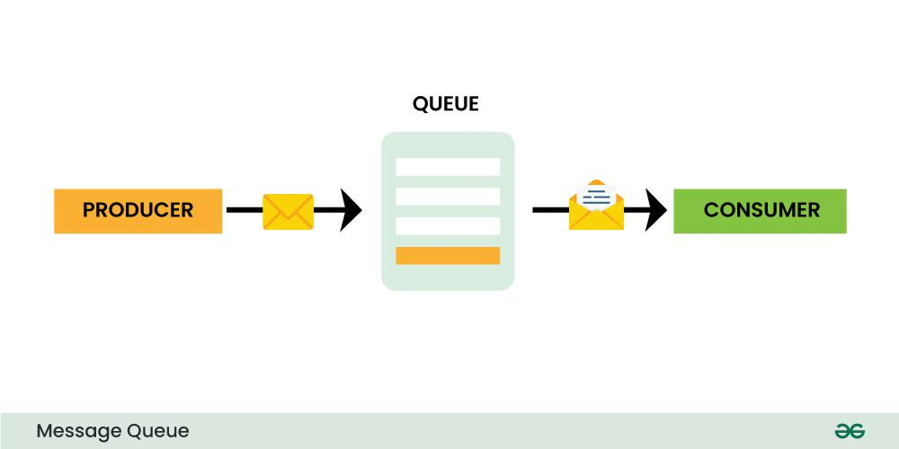
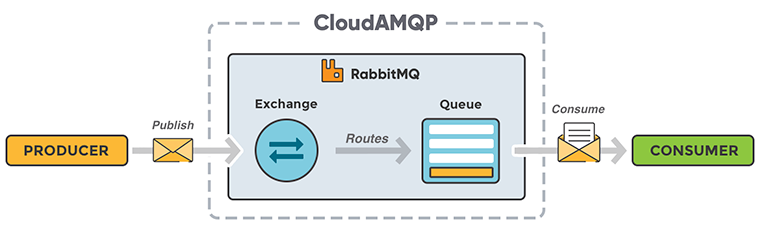
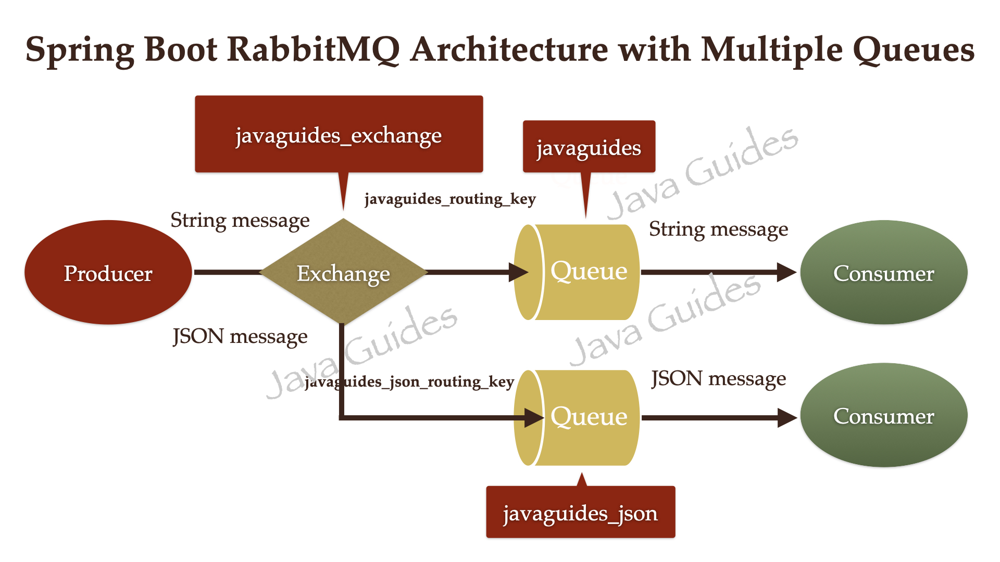

MESSAGE QUEUE :-

Message queueing allows applications to communicate by sending messages to each other. The message queue provide temporary message storage when the destination program is busy or not connected.

A message queue is made up of a producer, a broker(the message queue software) and a consumer.

A message queue provides an asynchronous communication between applications.

---

RABBIT MQ :-

RabbitMQ is a message queue software (message broker/queue manager) that acts as an intermediary platform where different applications can send and receive messages.

RabbitMQ originally implements the Advanced Message Queuing Protocol (AMQP). But now RabbitMQ also supports several other API protocols such as STOMP, MQTT and ΗΤΤΡ.

---

RABBITMQ CORE CONCEPTS :-

Producer - Producer is an application that sends messages. It does not send messages directly to the consumer. It send messages only to the RabbitMQ broker.

Consumer - Consumer is an application that reads messages from RabbitMQ broker.

Queue - Queue is a buffer or storage in a RabbitMQ broker to store the messages.
The messages are put into a queue by a producer and read from it by a consumer. Once a message is read, it is consumed and removed from the queue. A message can thus only be processed exactly once.

Message - Information that is sent from the producer to a consumed through RabbitMQ.

Exchange - Basically, it acts as an intermediary between the producer and a queue. Instead of sending messages directly to a queue, a producer can send them to an exchange instead. The exchange then sends those messages to one or more queues following a specified set of rules. Thus, the producer does not need to know the queues that eventually receive those messages.

Routing Key - The routing key is a key that the exchange looks at to decide how to route the message to queues. The routing key is like an address for the message.

Binding - A binding is a link between a queue and a exchange.

---

ARCHITECTURES :----

MESSAGING SYSTEM :-

RABBIT MQ ARCHITECTURE :-

RABBITMQ ARCHITECTURE WITH MULTIPLE QUEUES :-

---

Install RabbitMQ using Docker :-

- go to dockerhub
- search rabbitmq
- select tag that contain management like 3.13.7-management
- open terminal
- docker pull rabbitmq:3.13.7-management
- docker run --rm -it -p 15672:15672 -p 5672:5672 rabbitmq:3.13.7-management
  - port 15672 is for the rabbitmq management website
  - port 5672 is used for rabbitmq client connections
- hit http://localhost:15672 on browser
  - username - guest
  - password - guest

---

RABBITMQ WITH SPRING BOOT -------

Connection between spring boot and rabbit mq :-

- define properties in application.properties

Configure rabbitMQ :-

- create RabbitMQConfig.java in config package

Create rabbitmq producer :-

- create RabbitMQProducer.java in producer package

Create REST API to send message :-

- create MessageController.java in controller package

Create rabbitmq consumer :-

- create RabbitMQConsumer.java in consumer package

Configure RabbitMQ for Json Message Communication :-

- create queue in config class
- create binding between queue and exchange in config class
- create message converter in config class
- create rabbit template in config class
- create dto class
- create RabbitMQJsonProducer in producer package
- create controller to send json object in controller package
- create RabbitMQJsonConsumer in consumer package

Error :-
When 8080 port is busy
netstat -ano | findstr :8080
taskkill /PID PID_number /F
